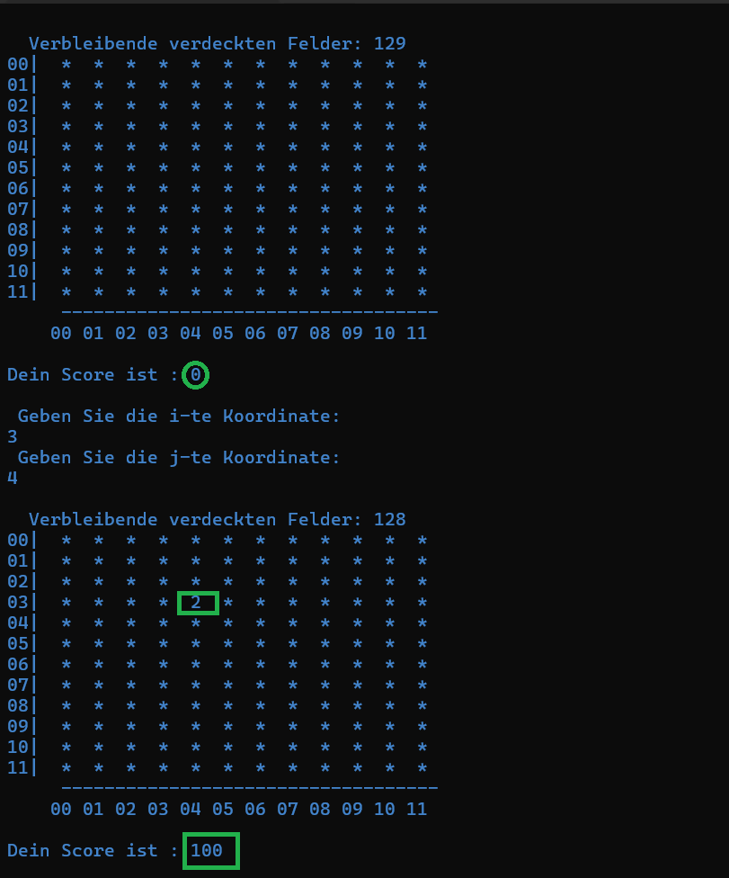

# Minesweepers
Diese Anwendung ist nur in Terminal Auszuführen.  
Sie wurde einfach zum Verstehen der Logik hinter Spielprogrammen gemacht. 

## zur Ausführung
Sie können dafür das Verzeichnis klonen und den datei __SpielFeld.exe__ ausführen. 

## Beschreibung
Es gibt insgesamt 144 Kacheln und 15 Bomben die zufällig auf dem Spielfeld verteilt sind.
Jede Kachel hat vier Zustände:
- `*`: heißt, dass sie noch nicht markiert (ausgewählt) ist
- `.`: sie ist markiert und keine ihre 8 Nachbarn sind Bomben
- `X`: sie ist eine Bombe
- `Ziffer(1-8) `: Anzahl der Nachbarn, die Bomben sind

Sie Haben auch :  
* `Score`:
    * +50*nb_ Punkte für gute Auswahl mal die Anzahl der Bomben im Nachbarschaft (also +0 wenn es keine gibt);
    * -100 Punkte, Wenn Sie auf Bomben fallen;
    * Wenn Sie ein negatives Score haben geht das Spiel zu Ende
* `Verbleibende Felder`: Anzahl der Kacheln, die Aufzudecken und keine Bomben sind.

   Wenn diese Zahl zu 0 kommt haben Sie gewinnen🎉
  
  
  
  ___!!Viel Spaß Beim Probieren dieser Terminal-Version✌️___
## Bild Demo

